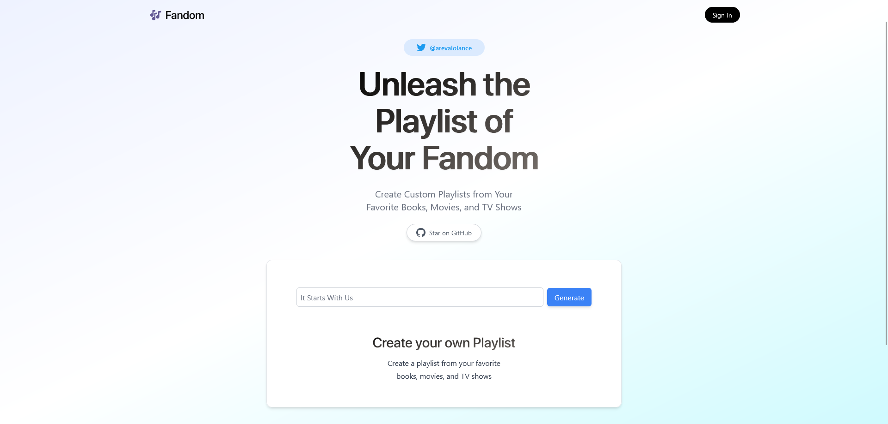

# [Fandom - Create Custom Playlists from Your Favorite Books, Movies, and TV Shows](https://fandom.vercel.com)

[](https://fandom.vercel.com)

## How it works

This project uses OpenAI's GPT-3 (text-davinci-003) to generate playlists based on your favourite Book, Movie, or TV Show. The API runs on [Vercel Edge Functions](https://vercel.com/features/edge-functions).

The client sends a custom prompt (w/ user input) to the backend which then gets processed by the GPT-3 API. After receiving the response, it returns the list of songs back to the client.

## How to run locally

You'll need an API key from OpenAI. Create your account and retrieve your (https://beta.openai.com/account/api-keys).

Create your own `.env` file and copy the required keys from the `.env.example` template

Then, run the application using the command line:

```
npm run dev
```

Access through `http://localhost:3000`

---

This project is heavily influenced by the following projects:

- Precedent: https://github.com/steven-tey/precedent
- Twitter Bio Generator: https://github.com/Nutlope/twitterbio

Thank you!
